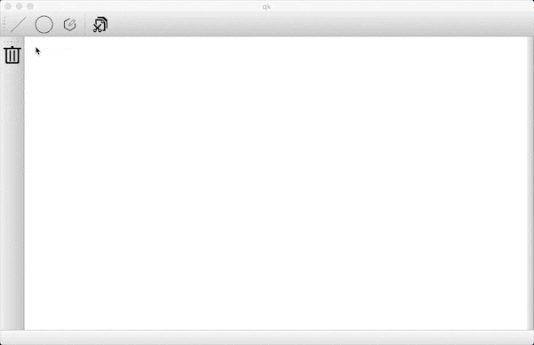

# Computer-Graphics

## 运行和实现环境
Qt版本` 5.14.1`
在 `Qt Creator` 中，点击 `MyselfQQ.pro` 文件打开项目，点击编译运行即可

## 功能实现
+ 用DDA算法、中点算法、Bresenham算法画直线段
+ 用中点算法画圆
+ 用扫描线算法和种子填充算法对多边形进行填充
+ 用Cohen-Sutherland算法和中点分割算法对直线段进行裁剪
+ 给定原点，对二维图形进行平移、放缩、旋转变换

## 示例

